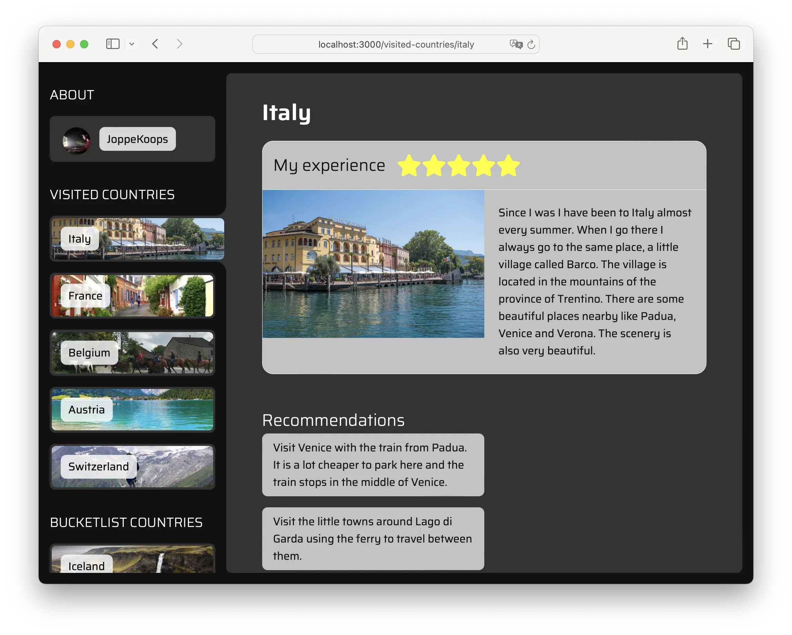
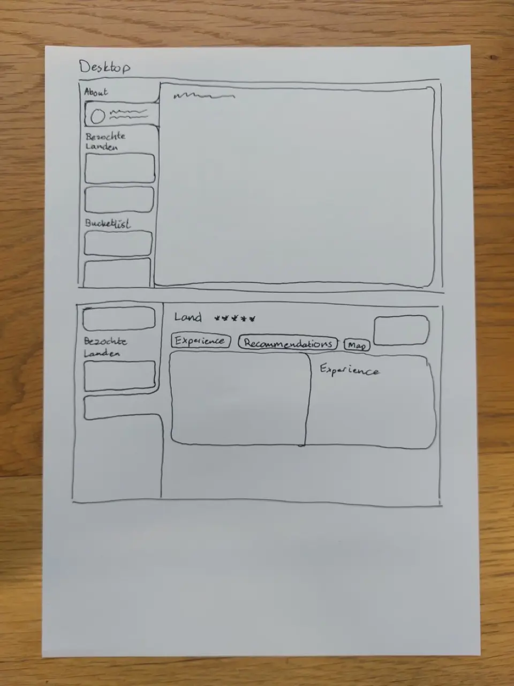
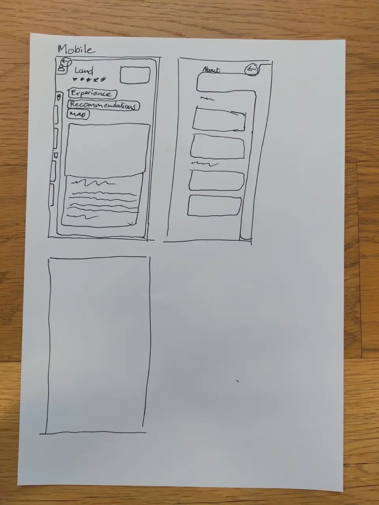
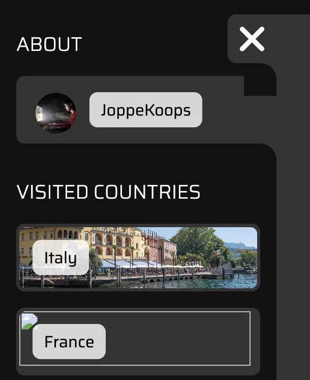
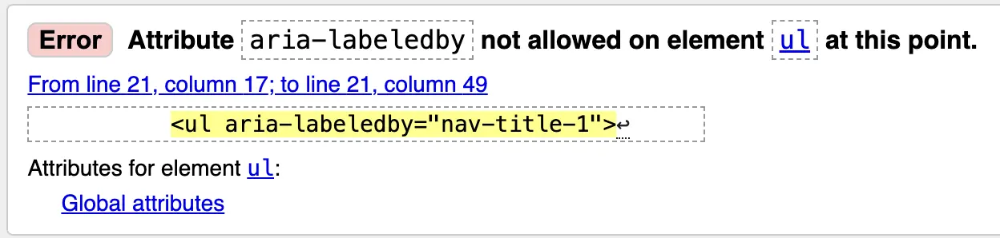
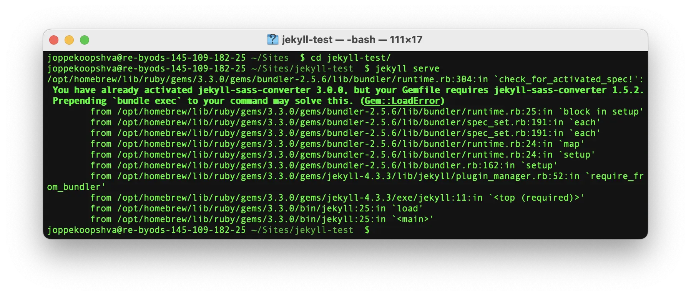

# Web App From Scratch @cmda-minor-web 2023 - 2024



## 📝 Beschrijving
Ik heb een ***single page application (SPA)*** gemaakt, met de focus op *front-end JavaScript*. Centraal staat de ***front-end router***, die in de achtergrond de nieuwe pagina ophaald, waardoor de website niet hoeft te herladen.

In de applicatie is informatie over mijzelf te zien, een aantal landen waar ik geweest ben en een aantal landen waar ik nog graag heen wil. Per land staat mijn beleving en aanbevelingen of de reden waarom ik er graag heen wil.

Ja kan mijn wep app *live* vinden op https://wafs-dot-erudite-imprint-214919.ew.r.appspot.com/

## ⚙️ *Features*
- ### 🗺️ ***Frond-end routing***
In plaats van dat de *routing* door de *back-end* wordt gedaan, zoals meestal het geval is, wordt in deze app alle *routing* in de *front-end* gedaan. Behalve dan dat in de *back-end* alle pagina's naar ```index.html``` worden gestuurd.

Het **voordeel** hiervan is dat de pagina niet hoeft te herladen om nieuwe data voor de pagina op te halen.

Een **nadeel** is wel dat het niet *progressively enhanced* is en dus niet werkt als de *JavaScript* niet wordt geladen.

Alle *routes* worden aangegeven in een *array*. Daarbij kunnen parameters aangegeven worden met een ```:```. Bij elke *route* staat een bijhorende view die bestaat uit een *JavaScript class*.

*Array*:

```js
const routes = [{
			path: '/',
			view: aboutView
		},
		{
			path: '/visited-countries/:id',
			view: visitedCountryView
		},
		{
			path: '/bucketlist-countries/:id',
			view: bucketlistCountryView
		}
	];
```

Voorbeeld *class*:

```js
import abstractView from './abstractView.js';

export default class extends abstractView {
	constructor(params, data) {
		super(params, data);
		this.setTitle(this.params.id);
	}

	// HTML toevoegen aan de main

	async getHtml() {
		return `
			<h1>${this.data.title}</h1>
			<p>${this.data.text}</p>
		`;
	}
}
```

- ### 🏗️ **Dynamische navigatie opbouw**
De navigatie colom aan de linkerkant van de pagina word door de *JavaScript* opgebouwd op basis van welke data er beschikbaar is. Hierdoor kan er gemakkelijk een pagina worden toegevoegd of verwijderd in de `info.json`. Die verschijnt dan vanzelf op de pagina.

De structuur van de pagina wordt wel bepaald in de *JavaScript*. Hier zijn een aantal functies om bijvoorbeeld een titel toe te voegen of een lijstje met navigatie onderdelen.

```js
const buildNav = () => {
	
	//Titel toevoegen

	nav.appendChild(createNavTitle('Visited Countries'));

	//Lijst maken met alle bezochte landen

	let visitedCountriesList = document.createElement('ul');
	personalInfo.visitedCountries.forEach(country => {
		visitedCountriesList.appendChild(createNavItem('/visited-countries/' + country.country.toLowerCase(), country.country, country.imgUrl));
	});
	nav.appendChild(visitedCountriesList);
}
```

- ### ✅ *Progressively enhanced* navigatie met *checkbox*
Op kleinere schermen schuift de navigatie aan de linker kant een stukje het scherm uit zodat er genoeg ruimte is voor de inhoud. Dit gebeurt doormiddel van een *checkbox*. Op deze manier is er geen *JavaScript* nodig om deze functionaliteit te laten werken.
Als de *checkbox* in de main een ```:checked``` status heeft, wordt de navigatie open geklapt. De standaard *checkbox* vormgeving is verwijderd met ```appearance: none;```;

## 📄 Data
Alle data is opgeslagen in `docs/info.json`. Hierdoor staat alle content bij elkaar. De data wordt in een keer opgehaald als je app voor de eerste keer wordt geladen. De data wordt dan opgeslagen in de variable ```personalInfo```. In plaats van elke keer de data opnieuw van de server op te vragen, is het veel sneller om deze variabele te gebruiken.

## 🛠️ Installatie
Mijn app gebruikt een beetje *Node.js* in de *back-end*. Om de app de draaien zal je dus Node geinstalleerd moeten hebben. https://nodejs.org/en/download

*Clone* de app van *Github* met:
```
git clone https://github.com/joppekoops/web-app-from-scratch-2324.git
```

Installeer de *node packages* met:
```
npm i
```

En start vervolgens de app met:
```
npm start
```

## 👨‍💻 Proces

### 💡 Het idee
Bij een *single page app* dacht ik gelijk aan een *front-end router*. Daarmee zou ik alle content er in kunnen zetten zonder dat het een lange pagina wordt.
Als groepje hadden we het idee om van iedereen weer te geven waar ze geweest zijn en nog graag naar toe willen. Deze data kon ik ook goed gebruiken voor mijn individuele applicatie. Ik heb een simpele schets gemaakt voor hoe ik het er uit wil laten zien.

| 🖥️ Desktop schets | 📱 Mobiele schets |
| --- | --- |
|||

Het idee voor de navigatie balk komt van deze tutorial van *Kevin Powell*: https://www.youtube.com/watch?v=SkML640BcoA.

### *Lay-out* maken
Ik ben begonnen bij het maken van de *lay-out* met HTML en CSS. Dit ging vrij makkelijk behalve wat kleine probleemjes.



De binnen rondingen in de navigatie maak ik met een zwart vierkantje met een ronde hoek die over een grijze achtergrond ligt. Deze staan op de ```:before``` en ```:after``` van elk item. Meestal is dit geen probleem, maar wel bij de knop om de navigatie te openen en sluiten, daar valt het zwarte vierkantje over de rest van de navigatie heen. Na even zoeken en proberen lijkt hier niet een goede oplossing voor te zijn. 

### ♿️ Toegankelijkheid navigatie
Om de navigatie toegankelijk te maken ben ik begonnen met het testen met een *screenreader*. Hieruit kwamen een aantal bevindingen:
- De checkbox die ik gebruik als open- en sluitknop wordt als checkbox genoemd.
- Als je navigatie is ingeklapt wordt die nog wel voorgelezen.
- Van de verschillende lijstjes in de navigatie is niet heel goed duidelijk waar ze voor zijn.

Voor de checkbox heb ik een aantal *aira* attributen toegevoegd:
```html
<input type="checkbox" role="button" aria-controls="navigation" aria-label="toggle main navigation" aria-expanded="true">
```
```role="button"``` maakt van de *checkbox* een *button*.
```aria-controls="navigation"``` koppelt de *button* aan de navigatie.
```aria-label=""``` geeft de *button* een naam, omdat er alleen een icoon op staat.
```aria-expended=""``` geeft aan of de navigatie open staat of niet. Deze wordt in de *JavaScript* aangepast.

Om de navigatie niet te laten voorlezen als die is ingeklapt voeg ik met de *JavaScript* ```aria-hidden="true"``` toe als dat zo is. Het staat er niet standaard op, want als je JavaScript niet werkt, moet de navigatie wel kunnen worden voorgelezen.

De lijstjes in de navigatie heb ik een ```aria-labelledby``` gegeven. Later gaf de validator aan dat dit geen goed idee is. Dus heb ik ze er weer af gehaald. Volgens dit artikel is dit inderdaad ook zo: https://www.scottohara.me/blog/2020/05/02/labelled-lists.html. Ik ben het er niet helemaal mee eens. Het werkt namelijk wel zoals ik zou verwachten. De *screenreader* zegt gewoon *"list visited countries 4 items"*.



### 🗺️ *Front-end router* maken
Voor de *front-end router* heb ik twee YouTube *tutorials* gevolgd. Dit ging heel makelijk. De problemen kwamen meer daarna, toen ik er zelf mee verder moest. Daarvoor moest ik eerst beter begrijpen hoe de *router* precies werkt. Ik heb de *tutorials* nog een keer gekeken om de uitleg nog een keer door te nemen. Daarbij heb ik *comments* bij mijn code gemaakt om later terug te kunnen lezen.

Het grootste probleem was het invullen van mijn data in de verschillende *views*. Elke keer als ik de data binnen haalde kreeg ik de *promise* terug in plaats van de data.
Als ik dan de *promise* afwachte kreeg ik wel de data terug.

```js
await personalData;
```

Maar als ik dan iets uit de data wilde hebben, kon dit niet gevonden worden omdat de datastructuur nog niet bekend was.

Marten gaf me de tip om eerst een lijstje te maken met welke stappen er moesten gebeuren voor het laden van een *view*.

Na dat de pagina geladen is moet:
1. De data worden opgehaald
2. De data worden opgeslagen
3. De route vinden
4. De view van de route laden met de data

Als de view wisseld word de data niet opnieuw ingeladen.

Hieruit kwam het volgende stukje code:

```js
let personalInfo;

document.addEventListener('DOMContentLoaded', async () => {

	personalInfo = await getInfo();

	router();

});
```

Nu kon ik de data gebruiken in de view. Bijvoorbeeld hier:

```js
const country = this.data.visitedCountries.find(country => country.country === countryName);
```

### 🥵 Beetje *back-end*
Bij de *front-end router* hoort een klein beetje *back-end* om er voor te zorgen dat alle routes bij `index.html` uit te laten komen. In de tutorial werd dit gedaan met *Node.js*, maar mijn app draait in *Github pages*. Omdat dit draait op *jekyll* (*Ruby package*) zou het mogelijk zijn om daar wat configuratie voor op te zetten, zoals volgens dit antwoord op *Stack overflow*: https://stackoverflow.com/questions/29390425/github-pages-url-rewrite-support

Ik heb dit een aantal keer geprobeerd met behulp van artikelen van Github zelf.
- https://docs.github.com/en/pages/setting-up-a-github-pages-site-with-jekyll/about-github-pages-and-jekyll
- https://docs.github.com/en/pages/setting-up-a-github-pages-site-with-jekyll/creating-a-github-pages-site-with-jekyll
- https://docs.github.com/en/pages/setting-up-a-github-pages-site-with-jekyll/testing-your-github-pages-site-locally-with-jekyll

Hierbij kreeg ik steeds errors dat de ene package een andere versie van een andere nodig heeft.



Na één dag uitproberen heb ik het opgegeven en heb ik het met *Node.js* gedaan. De website wordt nu gehost in *app engine* in *Google cloud*.

### 🏗️ Navigatie bouwen met JS
Om de navigatie te verbeteren wilde ik die opbouwen met *JavaScript* op basis van de data in mijn `info.json`. Hierdoor is de nav altijd *up-to-date* met mijn landen, als ik die ooit bijwerkt.

Hiervoor heb ik mijn lijstje aangepast naar:
1. De data ophalen
2. De data opslaan
3. Navigatie bouwen
4. De route vinden
5. De *view* van de route laden met de data

De code werd nu:

```js
let personalInfo;

document.addEventListener('DOMContentLoaded', async () => {

	personalInfo = await getInfo();

	buildNav();

	router();

});
```

Omdat niet alles in de nav in dezelfde lijst staat, heb ik voor de `buildNav()`-functie not een aantal functies aangemaakt, waarmee ik gemakkelijk verschillende onderdelen voor de navigatie kan generen, zoals een titel of een lijstje met links.

📋 TO DO:

Hier moet ik nog wel de lijstjes los opbouwen zoals hieronder. Eigenlijk zou ik hier ook graag nog een functie voor maken.

```js
let aboutList = document.createElement('ul');
	aboutList.appendChild(createNavItem('/', personalInfo.firstName + personalInfo.lastName, personalInfo.avatar_url));
	nav.appendChild(aboutList);

	nav.appendChild(createNavTitle('Visited Countries'));
```

Ook staat dit nu nog in de `script.js`. Dit zou ik graag in een aparte *class* hebben.

### Simpele laad status toevoegen
Afhankelijk van je internet snelheid kan het een tijdje duren voordat de pagina geladen is. Tijdens dat dit gebeurt wilde ik daarom een laad status toevoegen. In de HTML heb ik een simpel skelet van de pagina gezet. Wanneer de data begint met laden wordt er een draaiende cirkel toegevoegd. Die wordt daarna vervangen met de content. Mijn lijstje kreeg hierdoor nog een extra stap:

1. Lader toevoegen aan de pagina
2. De data ophalen
3. De data opslaan
4. Navigatie bouwen
5. De route vinden
6. De *view* van de route laden met de data

## ✅ Wensen lijst
- [ ] Nu ik een router heb gebouwd zou een volgende stap zijn om ook de voordelen te gebruiken met bijvoorbeeld overgangen tussen de verschillende *views*.
- [ ] Wat nog moet gebeuren is de code een stuk netter maken. Verschillende functionaliteiten kunnen in verschillende bestanden worden gezet die kunnen worden geïmporteerd.

## ℹ️ Bronnen
- Kevin Powell. (2024, 11 januari). Create a clean, modern navigation with HTML & CSS [Video]. YouTube. https://www.youtube.com/watch?v=SkML640BcoA
- Results of labeling lists (and list items!) | scottohara.me. (2023, 24 maart). https://www.scottohara.me/blog/2020/05/02/labelled-lists.html
-dcode. (2020a, augustus 24). Build a Single Page Application with JavaScript (No Frameworks) [Video]. YouTube. https://www.youtube.com/watch?v=6BozpmSjk-Y
- dcode. (2020, 27 augustus). Adding Client Side URL Params - Build a Single Page Application with JavaScript (No Frameworks) [Video]. YouTube. https://www.youtube.com/watch?v=OstALBk-jTc
- Build a Single Page Application with JavaScript (No Frameworks) - dcode. (z.d.). https://dcode.domenade.com/tutorials/build-a-single-page-app-with-javascript-no-frameworks
- GitHub Pages - URl Rewrite Support. (z.d.). Stack Overflow. https://stackoverflow.com/questions/29390425/github-pages-url-rewrite-support
- Quickstart. (2024, 13 februari). Jekyll • Simple, blog-aware, static sites. https://jekyllrb.com/docs/
- About GitHub Pages and Jekyll - GitHub Docs. (z.d.). GitHub Docs. https://docs.github.com/en/pages/setting-up-a-github-pages-site-with-jekyll/about-github-pages-and-jekyll
- Creating a GitHub Pages site with Jekyll - GitHub Docs. (z.d.). GitHub Docs. https://docs.github.com/en/pages/setting-up-a-github-pages-site-with-jekyll/creating-a-github-pages-site-with-jekyll
- Testing your GitHub Pages site locally with Jekyll - GitHub Docs. (z.d.). GitHub Docs. https://docs.github.com/en/pages/setting-up-a-github-pages-site-with-jekyll/testing-your-github-pages-site-locally-with-jekyll
- Jekyll. (z.d.). GitHub - jekyll/jekyll-redirect-from: :twisted_rightwards_arrows: Seamlessly specify multiple redirections URLs for your pages and posts. GitHub. https://github.com/jekyll/jekyll-redirect-from
- Writing Your Web Service with Node.js. (z.d.). Google Cloud. https://cloud.google.com/appengine/docs/standard/nodejs/building-app/writing-web-service

<!-- Add a link to your live demo in Github Pages 🌐-->

<!-- ☝️ replace this description with a description of your own work -->

<!-- replace the code in the /docs folder with your own, so you can showcase your work with GitHub Pages 🌍 -->

<!-- Add a nice poster image here at the end of the week, showing off your shiny frontend 📸 -->

<!-- Maybe a table of contents here? 📚 -->

<!-- How about a section that describes how to install this project? 🤓 -->

<!-- ...but how does one use this project? What are its features 🤔 -->

<!-- What external data source is featured in your project and what are its properties 🌠 -->

<!-- Maybe a checklist of done stuff and stuff still on your wishlist? ✅ -->

<!-- How about a license here? 📜 (or is it a licence?) 🤷 -->